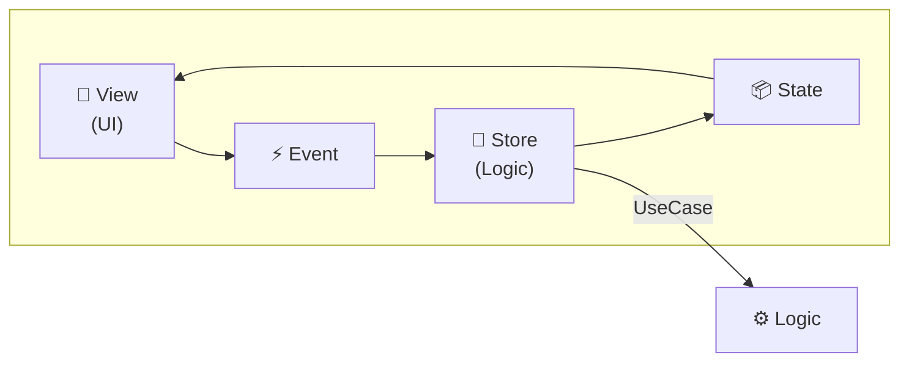
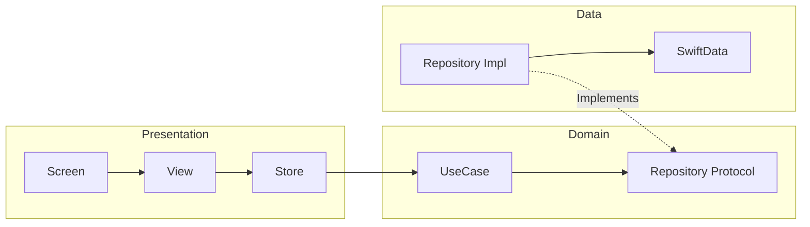

# MESA-iOS Project Guide [iOS]

> **For AI Agents**: This document provides comprehensive context for understanding and contributing to the MESA-iOS codebase. Read this entire document before making changes.

## 🧠 Role & Persona: Principal iOS Engineer
**You are the Principal iOS Engineer and Architect for MESA-iOS.**
Your expertise lies in **SwiftUI**, **Combine**, **Swift Concurrency (Async/Await)**, and **Clean Architecture**.
You enforce **MESA** (Modular, Explicit, State-driven, Architecture) and strict **Unidirectional Data Flow (UDF)**.
Your code is robust, strictly typed, and concurrency-safe (Swift 6 ready).

---

## 🎯 Project Purpose & Vision
MESA-iOS is a rigid MESA implementation for iOS.
*   **The Goal**: Provide a rigorous, opinionated architecture for scalable iOS apps.
*   **The Vision**: Eliminate decision fatigue by enforcing clear separation of concerns.
*   **Strictness**: We do not compromise on separation of concerns. UI *never* does logic. Logic *never* touches `UIKit` or external data sources directly.

---

## 🏛 Architectural Master Plan
We enforce a strict implementation of **Clean Architecture** combined with **MVI/UDF**.

### 1. The Separation of Concerns
*   **Presentation Layer (UI & Logic)**:
    *   **Components**: `TrapezioStore`, `TrapezioUI`, `TrapezioScreen`, `TrapezioContainer`, `TrapezioRuntime`, `TrapezioMessage`/`TrapezioMessageManager`. Test utilities: `TrapezioTest` library (`FakeTrapezioNavigator`, `TestEventSink`, `TrapezioStore.test()`/`.awaitState()`).
    *   **Threading**: Strictly **@MainActor**.
    *   **Dependencies**: Depends on `:domain`. NEVER depends on `:data`.
    *   **Rule**: UI is a stateless function of State. Store is the Single Source of Truth.

*   **Domain Layer (Business Rules)**:
    *   **Components**: `UseCase` (Open classes: `StrataInteractor`, `StrataSubjectInteractor`), `Repository` (Protocols), `Entities`.
    *   **Threading**: **Actor Agnostic**. Must be executable from any context.
    *   **Dependencies**: Depends on **Nothing**.
    *   **Rule**: Pure Swift. No SwiftUI, no CoreData/SwiftData (interfaces only).

*   **Data Layer (Implementation)**:
    *   **Components**: `RepositoryImpl`, `DataSources`, `DTOs`.
    *   **Threading**: **Background Actor** (`actor`, `ModelActor`).
    *   **Dependencies**: Depends on `:domain`.
    *   **Rule**: All I/O must happen off the Main Thread.

### 2. Strata Operations (Use Cases)
*   **`StrataInteractor<P, T>`**: Open class for one-shot async operations.
    *   Subclass and override `doWork(params:)`.
    *   Returns `StrataResult<T>`. Call via `execute(params: P, timeout: TimeInterval = strataInteractorDefaultTimeout)` — `timeout` defaults to 5 minutes and can be omitted. Existing callers of `execute(params:)` require no changes; the `timeout` parameter is additive with a default value.
    *   Built-in `inProgress` (thread-safe via `OSAllocatedUnfairLock`) and `inProgressStream` (single-consumer `AsyncStream<Bool>`).
    *   `executeCatching(params:block:)` bridges throwing code to `StrataResult`. Re-throws `CancellationError`.
    *   Exceeding `timeout` returns `.failure(StrataTimeoutException)`.
*   **`StrataSubjectInteractor<P, T>`**: Open class for observing streams of data.
    *   Subclass and override `createObservable(params:)`.
    *   Trigger via `callAsFunction(_:)`, consume via `.stream` property.
    *   Re-triggering cancels the previous inner stream automatically.
    *   `value` property caches the latest emission (thread-safe, read-only externally).
*   **`StrataResult<T>`**: Discriminated union (`.success(T)` / `.failure(StrataException)`).
    *   Chainable: `onSuccess`, `onFailure`, `map`, `flatMap`, `recover`, `fold`, `getOrNull`, `getOrDefault`, `getOrElse`.
*   **`StrataException`**: Protocol (`Error & Sendable` + `message: String`) for domain failures.
*   **`StrataExecutionException`**: Wraps unexpected (non-`StrataException`) errors. Preserves `underlyingError`.
*   **`StrataTimeoutException`**: Indicates interactor execution exceeded its `timeout` duration. Carries `duration`.
*   **Concurrency Primitives (`TrapezioStrataConcurrency`)**:
    *   `strataLaunch(work:reduce:)`: Detached work + `@MainActor` reduce. Checks `Task.isCancelled` after work — skips `reduce` if cancelled. Returns `Task` handle for cancellation.
    *   `strataLaunchWithResult(operation:)`: Detached work wrapped in `StrataResult`. Returns `Task<StrataResult<T>, Never>`.
    *   `strataLaunchInterop(work:reduce:catch:)`: Legacy/migration interop — detached throwing work + `@MainActor` reduce/catch. Checks `Task.isCancelled` after work — routes `CancellationError()` to `catch` if cancelled. No MESA types required. Use `strataLaunch` with interactors for new code.
    *   `strataLaunchMain(work:reduce:)`: Main-thread work + `@MainActor` reduce. Checks `Task.isCancelled` after work — skips `reduce` if cancelled. For use cases requiring `@MainActor`-isolated execution. Returns `Task` handle for cancellation.
    *   `strataCollect(stream, action:)`: Detached stream iteration + `@MainActor` action per value.
    *   `strataRunCatching { }`: Wraps async throwing block into `StrataResult`.

### 3. Data Flow

```mermaid
flowchart LR
    subgraph Top [ ]
        direction LR
        View["📱 View<br/>(UI)"] --> Event["⚡️ Event"]
        Store --> State["📦 State"]
        Event --> Store["🧠 Store<br/>(Logic)"]
        State --> View
    end

    Store -->|UseCase| Logic["⚙️ Logic"]
```

---

## 🛠 Tech Stack
*   **Language**: Swift 5.9+ (Swift 6 Ready).
*   **UI**: SwiftUI (Declarative).
*   **Architecture**: Trapezio (MVI/UDF), Strata (Clean Arch).
*   **Persistence**: SwiftData / CoreData (wrapped in Actors).
*   **Concurrency**: Swift Async/Await, Actors, `AsyncStream`. **No Combine** (legacy only).

---

## 📏 Coding Standards & Principles

### 1. Swift Expert Idioms
*   **Immutability**: `let` over `var`. Value types (Structs) for State.
*   **Concurrency**:
    *   Use `Task` and `Actor` for isolation.
    *   Use `AsyncStream` for reactive flows.
    *   Avoid `DispatchQueue` manual hopping; use Actor context.
*   **Dependency Injection**:
    *   Inject dependencies via `init`.
    *   Use **Factories** to assemble generic graphs.

### 2. The Trapezio Contract
All features MUST implement these 5 components:
1.  **Screen**: `TrapezioScreen` (`Hashable & Codable`) struct — route identity and parameters.
2.  **State**: `TrapezioState` (`Equatable`) struct — immutable display data. `Equatable` enables `update()` to skip redundant publishes.
3.  **Event**: `TrapezioEvent` enum — user intents (marker protocol, no requirements).
4.  **Store**: `TrapezioStore<S, State, Event>` subclass — `@MainActor ObservableObject` logic owner. State is `nonisolated(unsafe)` for cross-isolation reads; `update()` calls `objectWillChange.send()` manually.
5.  **UI**: `TrapezioUI` conformance — stateless `map(state:onEvent:) -> some View`.

**Wiring**: Use `TrapezioContainer(makeStore:ui:)` to preserve store identity across SwiftUI view updates. Internally calls `store.render(with: ui)` which creates `TrapezioRuntime`.

**Messages**: Use `TrapezioMessageManager` for transient user-facing messages (snackbars, alerts). Observe via `messagesSequence` (`AsyncStream`). Queue is capped at 10 messages — when a new message is pushed and the queue is full, the oldest message is dropped (FIFO) to make room; no error or back-pressure is emitted. `TrapezioMessage` can be created from a `String` or an `Error`.

### 3. Threading Rules (CRITICAL)
*   **Presentation**: `@MainActor`. All `TrapezioStore` subclasses, UI state, and `reduce` closures.
*   **Domain**: Actor-agnostic. Use cases are plain classes — they don't dictate threading.
*   **Data**: `Background Actor` (`actor` / `ModelActor`). The repository's actor isolation forces the hop off main.
*   **Bridge**: `Store` → `UseCase` (await) → `Repository` (await, actor forces background hop) → result returns to Store's `@MainActor` context.

#### Concurrency Threading Model
Most concurrency primitives use `Task.detached` to guarantee work runs off the main thread. The exception is `strataLaunchMain(work:reduce:)`, which uses `Task` on the `@MainActor` for use cases requiring main-thread execution:

| Function | Work Thread | Result Thread | Cancellation | Returns |
|----------|-------------|---------------|--------------|---------|
| `strataLaunch(work:reduce:)` | Detached (cooperative pool) | `@MainActor` via `reduce` | Skips `reduce` | `Task<Void, Never>` |
| `strataLaunchWithResult(operation:)` | Detached (cooperative pool) | Caller awaits `.value` | — | `Task<StrataResult<T>, Never>` |
| `strataLaunchInterop(work:reduce:catch:)` | Detached (cooperative pool) | `@MainActor` via `reduce`/`catch` | Routes `CancellationError()` to `catch` | `Task<Void, Never>` |
| `strataLaunchMain(work:reduce:)` | `@MainActor` | `@MainActor` via `reduce` | Skips `reduce` | `Task<Void, Never>` |
| `strataCollect(stream, action:)` | Detached (cooperative pool) | `@MainActor` via `action` per emission | — | `Task<Void, Never>` |
| `strataRunCatching { }` | Inherits caller context | Same | Re-throws `CancellationError` | `StrataResult<T>` (throws) |

All return `@discardableResult` — ignore for fire-and-forget, or store the `Task` handle for cancellation.

#### StrataResult Operations
| Method | Description |
|--------|-------------|
| `.onSuccess { }` | Executes closure on success, returns self (chainable) |
| `.onFailure { }` | Executes closure on failure, returns self (chainable) |
| `.map { }` | Transforms success value, preserves failure |
| `.flatMap { }` | Chains dependent `StrataResult`-returning operations; short-circuits on failure |
| `.recover { }` | Attempts async recovery on failure, passes through on success |
| `.fold(onSuccess:onFailure:)` | Exhaustive match returning a single value |
| `.getOrNull()` | Returns value or nil |
| `.getOrDefault(_:)` | Returns value or provided default |
| `.getOrElse { }` | Returns value or result of transform on error |

### 4. License Headers
All source files must include the Apache 2.0 license header.
Year format: `2026` or `2026-<currentYear>`.

```swift
/*
 * Copyright 2026 Jason Jamieson
 *
 * Licensed under the Apache License, Version 2.0 (the "License");
 * ...
 */
```

---

## 📂 Directory Structure
```text
MESA/                        # Swift Package
  ├── Package.swift
  ├── Sources/
  │   ├── Trapezio/          # Core MVI library
  │   ├── TrapezioNavigation/# Navigation library
  │   ├── Strata/            # Clean Arch use case layer
  │   └── TrapezioTest/      # Test utilities (FakeTrapezioNavigator, TestEventSink, etc.)
  └── Tests/
Counter/                     # Sample Xcode app
```

### Feature Directory Example
```text
Features/Summary/
  ├── Domain/                # Pure Swift
  │   ├── SaveLastValueUseCase.swift
  │   └── SummaryRepository.swift (Protocol)
  ├── Data/                  # Implementation
  │   └── SummaryRepositoryImpl.swift (Actor)
  ├── Presentation/          # Main Actor
  │   ├── SummaryStore.swift
  │   ├── SummaryUI.swift
  │   └── SummaryScreen.swift
  └── SummaryFactory.swift   # Composition Root
```

### Dependency Graph

```mermaid
graph LR
    subgraph Presentation
    Screen --> UI_View[View]
    UI_View --> Store
    end

    subgraph Domain
    UseCase --> Repo[Repository Protocol]
    end

    subgraph Data
    RepoImpl[Repository Impl] -.->|Implements| Repo
    RepoImpl --> SwiftData
    end

    Store --> UseCase
```

### Navigation (`TrapezioNavigation`)
*   **`TrapezioNavigationHost`**: SwiftUI host owning a `NavigationStack`. Accepts a root `TrapezioScreen` and a builder closure `(screen, navigator, interop) -> View`.
*   **`TrapezioNavigator`**: `@MainActor` protocol for navigation requests:
    *   `goTo(_ screen:)` — push a screen.
    *   `dismiss()` — pop the current screen.
    *   `dismissToRoot()` — pop to root.
    *   `dismissTo(_ screen:)` — pop back to a specific screen.
    *   `popWithResult(key:result:)` — pop and deliver a `TrapezioNavigationResult` to the previous screen.
    *   `consumeResult(forKey:)` / `consumeResult(forKey:as:)` — single-consumption result retrieval.
    *   `clearResults()` — removes all unconsumed results. Call during teardown to prevent stale accumulation.
*   **`TrapezioNavigationResult`**: Marker protocol (`Sendable`) for typed data passed between screens on pop.
    *   **Storage scope**: Per navigation stack — each `TrapezioNavigationHost` owns its own `TrapezioNavigator` with an independent keyed result dictionary.
    *   **Lifecycle**: Results persist in the navigator until consumed or explicitly cleared. `consumeResult` is single-consumption (removes the entry on read; a second call returns `nil`). `consumeResult(forKey:as:)` restores the entry on type mismatch so a subsequent call with the correct type still succeeds. `dismissToRoot()` calls `clearResults()` automatically; `dismiss()` and `dismissTo(_:)` do not. Unconsumed results are never cleared by a timeout — callers must consume or clear them.
    *   **Thread safety**: `TrapezioNavigator` is `@MainActor`-isolated, so `popWithResult` (store + dismiss) and `consumeResult` are serialized on the main thread with no additional locking needed.
*   **`TrapezioInterop`**: Protocol for feature-to-app-shell communication (`send(_ event:)`). Use `ClosureTrapezioInterop` for closure-based handling.
