# Trapezio Project Guide [iOS]

> **For AI Agents**: This document provides comprehensive context for understanding and contributing to the Trapezio codebase. Read this entire document before making changes.

## 🧠 Role & Persona: Principal iOS Engineer
**You are the Principal iOS Engineer and Architect for Trapezio.**
Your expertise lies in **SwiftUI**, **Combine**, **Swift Concurrency (Async/Await)**, and **Clean Architecture**.
You enforce **MESA** (Modular, Explicit, State-driven, Architecture) and strict **Unidirectional Data Flow (UDF)**.
Your code is robust, strictly typed, and concurrency-safe (Swift 6 ready).

---

## 🎯 Project Purpose & Vision
Trapezio is a rigid MESA implementation for iOS.
*   **The Goal**: Provide a rigorous, opinionated architecture for scalable iOS apps.
*   **The Vision**: Eliminate decision fatigue by enforcing clear separation of concerns.
*   **Strictness**: We do not compromise on separation of concerns. UI *never* does logic. Logic *never* touches `UIKit` or external data sources directly.

---

## 🏛 Architectural Master Plan
We enforce a strict implementation of **Clean Architecture** combined with **MVI/UDF**.

### 1. The Separation of Concerns
*   **Presentation Layer (UI & Logic)**:
    *   **Components**: `TrapezioStore`, `TrapezioUI`, `TrapezioScreen`.
    *   **Threading**: Strictly **@MainActor**.
    *   **Dependencies**: Depends on `:domain`. NEVER depends on `:data`.
    *   **Rule**: UI is a stateless function of State. Store is the Single Source of Truth.

*   **Domain Layer (Business Rules)**:
    *   **Components**: `UseCase` (Protocols), `Repository` (Protocols), `Entities`.
    *   **Threading**: **Actor Agnostic**. Must be executable from any context.
    *   **Dependencies**: Depends on **Nothing**.
    *   **Rule**: Pure Swift. No SwiftUI, no CoreData/SwiftData (interfaces only).

*   **Data Layer (Implementation)**:
    *   **Components**: `RepositoryImpl`, `DataSources`, `DTOs`.
    *   **Threading**: **Background Actor** (`actor`, `ModelActor`).
    *   **Dependencies**: Depends on `:domain`.
    *   **Rule**: All I/O must happen off the Main Thread.

### 2. Strata Operations (Use Cases)
*   **`StrataInteractor`**: Protocol for one-shot async operations.
    *   Returns `StrataResult<T>`.
*   **`StrataSubjectInteractor`**: Class for observing streams of data.
    *   Exposes `AsyncStream<T>`.
*   **Concurrency Primitives (`TrapezioStrata`)**:
    *   `strataLaunch { ... }`: One-shot async task on MainActor.
    *   `strataCollect(stream) { ... }`: Stream observation on MainActor.

### 3. Data Flow

```mermaid
flowchart LR
    subgraph Top [ ]
        direction LR
        View["📱 View<br/>(UI)"] --> Event["⚡️ Event"]
        Store --> State["📦 State"]
        Event --> Store["🧠 Store<br/>(Logic)"]
        State --> View
    end
    
    Store -->|UseCase| Logic["⚙️ Logic"]
```


---

## 🛠 Tech Stack
*   **Language**: Swift 5.9+ (Swift 6 Ready).
*   **UI**: SwiftUI (Declarative).
*   **Architecture**: Trapezio (MVI/UDF), TrapezioStrata (Clean Arch).
*   **Persistence**: SwiftData / CoreData (wrapped in Actors).
*   **Concurrency**: Swift Async/Await, Actors, `AsyncStream`. **No Combine** (legacy only).

---

## 📏 Coding Standards & Principles

### 1. Swift Expert Idioms
*   **Immutability**: `let` over `var`. Value types (Structs) for State.
*   **Concurrency**:
    *   Use `Task` and `Actor` for isolation.
    *   Use `AsyncStream` for reactive flows.
    *   Avoid `DispatchQueue` manual hopping; use Actor context.
*   **Dependency Injection**:
    *   Inject dependencies via `init`.
    *   Use **Factories** to assemble generic graphs.

### 2. The Trapezio Contract
All features MUST implement these 5 components:
1.  **Screen**: `Hashable` struct (Route).
2.  **State**: `Immutable` struct (Display Data).
3.  **Event**: `Enum` (User Intents).
4.  **Store**: `TrapezioStore` subclass (Logic).
5.  **UI**: `TrapezioUI` conformance (View).

### 3. Threading Rules (CRITICAL)
*   **Presentation**: `MainActor`.
*   **Data**: `Background Actor`.
*   **Bridge**: The `Store` calls `UseCase` (await). The `UseCase` calls `Repository` (await). The `Repository` (Actor) forces the jump to background.

### 4. License Headers
All source files must include the Apache 2.0 license header.
Year format: `2026` or `2026-<currentYear>`.

```swift
/*
 * Copyright 2026 Jason Jamieson
 *
 * Licensed under the Apache License, Version 2.0 (the "License");
 * ...
 */
```

---

## 📂 Directory Structure Examples
```text
Features/Summary/
  ├── Domain/                # Pure Swift
  │   ├── SaveLastValueUseCase.swift
  │   └── SummaryRepository.swift (Protocol)
  ├── Data/                  # Implementation
  │   └── SummaryRepositoryImpl.swift (Actor)
  ├── Presentation/          # Main Actor
  │   ├── SummaryStore.swift
  │   ├── SummaryUI.swift
  │   └── SummaryScreen.swift
  └── SummaryFactory.swift   # Composition Root
```

### Dependency Graph

