# MESA-iOS

**MESA-iOS — Trapezio is the iOS implementation of the MESA Framework (Modular, Explicit, State-driven, Architecture)**

Trapezio is a production-grade architectural library for SwiftUI, designed to enforce unidirectional data flow (UDF), strictly typed navigation, and a clean separation of concerns.

## 🏛 MESA Architecture Pillars

1.  **Modular**: Encourages feature-based partitioning. Features are isolated and portable.
2.  **Explicit**: Clear, type-safe boundaries between Routing (**Screen**), Logic (**Store**), and Rendering (**UI**).
3.  **State-driven**: The UI is a pure projection of the State. Unidirectional Data Flow is strictly enforced.
4.  **Architecture**: Provides the structural "Trapeze" to safely swing between Business Logic and UI.

### Data Flow

```mermaid
%%{init: {'theme': 'base', 'themeVariables': { 'primaryColor': '#007AFF', 'primaryTextColor': '#fff', 'primaryBorderColor': '#0051a8', 'lineColor': '#888', 'secondaryColor': '#f2f2f7', 'tertiaryColor': '#e5e5ea'}}}%%
flowchart LR
    subgraph Top [ ]
        direction LR
        View["📱 View<br/>(UI)"] --> Event["⚡️ Event"]
        Store --> State["📦 State"]
        Event --> Store["🧠 Store<br/>(Logic)"]
        State --> View
    end
    
    Store -->|UseCase| Logic["⚙️ Logic"]
    
    style View fill:#FF9500,stroke:#B36B00,stroke-width:2px,color:#fff,shadow:true
    style Event fill:#007AFF,stroke:#0051a8,stroke-width:2px,color:#fff,shadow:true
    style Store fill:#34C759,stroke:#248A3D,stroke-width:2px,color:#fff,shadow:true
    style State fill:#5856D6,stroke:#3634A3,stroke-width:2px,color:#fff,shadow:true
    style Logic fill:#AF52DE,stroke:#7A399B,color:#fff,stroke-dasharray: 5 5
```



---

## 📚 Libraries

| Module | Purpose | Key Components |
|:---|:---|:---|
| **Trapezio** | Core MVI/UDF primitives | `TrapezioStore`, `TrapezioState`, `TrapezioScreen`, `TrapezioUI`, `TrapezioContainer`, `TrapezioInterop`, `TrapezioMessage` |
| **TrapezioNavigation** | Type-safe Navigation | `TrapezioNavigator`, `TrapezioNavigationHost` |
| **Strata** | Clean Architecture & Logic | `StrataInteractor`, `StrataSubjectInteractor`, `StrataResult`, `strataLaunch`, `strataLaunchInterop`, `strataLaunchMain`, `strataLaunchWithResult`, `strataCollect`, `strataRunCatching` |

---

## 📦 Installation

### Swift Package Manager

Add MESA-iOS to your project via SPM:

```swift
dependencies: [
    .package(url: "https://github.com/jkjamies/MESA-iOS.git", from: "0.1.0")
]
```

Then add the libraries you need to your target:

```swift
.target(
    name: "YourApp",
    dependencies: [
        .product(name: "Trapezio", package: "MESA-iOS"),
        .product(name: "TrapezioNavigation", package: "MESA-iOS"),
        .product(name: "Strata", package: "MESA-iOS"),
    ]
)
```

### XCFramework

Pre-built XCFrameworks for each library are attached to every [GitHub Release](https://github.com/jkjamies/MESA-iOS/releases):

| Artifact | Contents |
|:---|:---|
| `Trapezio.xcframework.zip` | Core MVI/UDF primitives |
| `TrapezioNavigation.xcframework.zip` | Type-safe navigation |
| `Strata.xcframework.zip` | Clean Architecture use cases & concurrency helpers |

Download the `.xcframework.zip` for the libraries you need and add them to your Xcode project under **Frameworks, Libraries, and Embedded Content**.

---

## 🏗 Architectural Layers

Trapezio strictly enforces **Clean Architecture** combined with **MVI** for the presentation layer.

### 1. Presentation Layer (`:presentation`)
-   **Role**: Manages UI state and handles user interaction.
-   **Components**: `TrapezioStore`, `TrapezioUI`, `TrapezioScreen`, `TrapezioContainer`, `TrapezioRuntime`, `TrapezioMessage`/`TrapezioMessageManager`.
-   **Threading**: Strictly **Main Actor**.
-   **Dependencies**: Depends on **Domain**. NEVER depends on Data.

### 2. Domain Layer (`:domain`)
-   **Role**: Pure business logic.
-   **Components**:
    -   **Use Cases** (Open classes): `StrataInteractor<P, T>` (one-shot) and `StrataSubjectInteractor<P, T>` (stream-based).
    -   **Interfaces**: Repository protocols.
    -   **Models**: Pure data structures.
-   **Threading**: **Actor Agnostic**. Must be safe to call from any thread.
-   **Dependencies**: Depends on **Nothing** (except standard library).

### 3. Data Layer (`:data`)
-   **Role**: Data retrieval, persistence, and networking.
-   **Components**:
    -   **Repositories**: Implement Domain interfaces.
    -   **Data Sources**: Database (`SwiftData`), Network API.
-   **Threading**: Strictly **Background** (using `actor` / `ModelActor`).
-   **Dependencies**: Depends on **Domain**.

### Dependency Graph


---

## 🚀 Usage Guide

### 1. The Screen (Identity)
The `TrapezioScreen` is a `Hashable & Codable` struct acting as the route and configuration for a feature.
```swift
struct CounterScreen: TrapezioScreen {
    let initialValue: Int
}
```

### 2. The Store (Presentation Logic)
The `TrapezioStore` manages state. It injects **Use Cases** to perform work.
```swift
@MainActor
final class SummaryStore: TrapezioStore<SummaryScreen, SummaryState, SummaryEvent> {
    private let saveUseCase: SaveLastValueUseCase

    init(screen: SummaryScreen, saveUseCase: SaveLastValueUseCase) {
        self.saveUseCase = saveUseCase
        super.init(screen: screen, initialState: SummaryState(value: screen.value))
    }

    override func handle(event: SummaryEvent) {
        switch event {
        case .save:
            // Work runs detached (off main), reduce runs on @MainActor
            strataLaunch(
                work: { await self.saveUseCase.execute(params: self.state.value) },
                reduce: { result in
                    self.update {
                        $0.saveMessage = result.fold(
                            onSuccess: { _ in "Saved." },
                            onFailure: { error in "Failed: \(error.message)" }
                        )
                    }
                }
            )
        }
    }
}
```

### 3. The Use Case (Domain Logic)
Use Cases encapsulate specific business rules. Subclass `StrataInteractor<P, T>` (one-shot) or `StrataSubjectInteractor<P, T>` (stream).
```swift
final class SaveLastValueUseCase: StrataInteractor<Int, Void> {
    private let repository: SummaryRepository

    init(repository: SummaryRepository) {
        self.repository = repository
        super.init()
    }

    override func doWork(params: Int) async -> StrataResult<Void> {
        return await executeCatching(params: params) { val in
            try await repository.saveValue(val)
        }
    }
}
```

### 4. The UI (Stateless View)
The `TrapezioUI` is a pure mapping function `(State) -> View`. It calls `onEvent` to dispatch user intents.
```swift
struct CounterUI: TrapezioUI {
    func map(state: CounterState, onEvent: @escaping @MainActor (CounterEvent) -> Void) -> some View {
        VStack {
            Text("Count: \(state.count)")
            Button("Increment") { onEvent(.increment) }
        }
    }
}
```

### 5. The Factory (Composition Root)
`TrapezioContainer` preserves store identity across SwiftUI view updates. Factories assemble the dependency graph.
```swift
struct CounterFactory {
    @ViewBuilder @MainActor
    static func make(screen: CounterScreen, navigator: (any TrapezioNavigator)?, interop: (any TrapezioInterop)?) -> some View {
        TrapezioContainer(
            makeStore: CounterStore(screen: screen, divideUsecase: DivideUsecase(), navigator: navigator, interop: interop),
            ui: CounterUI()
        )
    }
}
```

### Key Protocols

| Protocol | Conforms To | Purpose |
|:---|:---|:---|
| `TrapezioScreen` | `Hashable`, `Codable` | Route identity and parameters |
| `TrapezioState` | `Equatable` | Immutable display data. `Equatable` enables `update()` to skip redundant publishes |
| `TrapezioEvent` | — | Marker protocol for user intents (no requirements) |
| `TrapezioUI` | — | Stateless `map(state:onEvent:) -> some View` |

### TrapezioStore Internals

- `@MainActor @Observable open class TrapezioStore<S, State, Event>`
- `state` is `nonisolated(unsafe) public private(set)` — enables cross-isolation reads from detached tasks while writes are restricted to `update()` on the main actor
- `update(_ transform:)` — copy-on-write mutation with `Equatable` check to prevent unnecessary SwiftUI re-renders
- `render(with: ui)` — binds the store to a `TrapezioUI` and returns a `TrapezioRuntime` view

### TrapezioMessage

`TrapezioMessageManager` provides transient user-facing messages (snackbars, alerts). Emit via `emit(_:)`, observe via `messagesSequence` (`AsyncStream<[TrapezioMessage]>`), clear via `clearMessage(id:)` or `clearAll()`.

---

## 🧵 Threading & Concurrency Model

Trapezio enforces a robust threading model to prevent UI jank and race conditions.

| Component | Thread / Actor | Rule |
|:---|:---|:---|
| **UI** | `@MainActor` | All rendering code must be on Main. |
| **Store** | `@MainActor` | State updates and `reduce` closures happen on Main. |
| **Use Case** | Actor-agnostic | Plain classes — they don't dictate threading. |
| **Repository** | `actor` | Database/Network I/O is forced to background. |

### Concurrency Primitives

Most primitives use `Task.detached` to guarantee work runs off the main thread. The exception is `strataLaunchMain(work:reduce:)`, which uses `Task` on the `@MainActor` for use cases requiring main-thread execution:

| Function | Work Thread | Result Thread | Returns |
|:---|:---|:---|:---|
| `strataLaunch(work:reduce:)` | Detached (cooperative pool) | `@MainActor` via `reduce` | `Task<Void, Never>` |
| `strataLaunchWithResult(operation:)` | Detached (cooperative pool) | Caller awaits `.value` | `Task<StrataResult<T>, Never>` |
| `strataLaunchInterop(work:reduce:catch:)` | Detached (cooperative pool) | `@MainActor` via `reduce`/`catch` | `Task<Void, Never>` |
| `strataLaunchMain(work:reduce:)` | `@MainActor` | `@MainActor` via `reduce` | `Task<Void, Never>` |
| `strataCollect(stream, action:)` | Detached (cooperative pool) | `@MainActor` via `action` per emission | `Task<Void, Never>` |
| `strataRunCatching { }` | Inherits caller context | Same | `StrataResult<T>` |

All return `@discardableResult` — ignore for fire-and-forget, or store the `Task` handle for cancellation.

### StrataResult Operations

| Method | Description |
|:---|:---|
| `.onSuccess { }` | Executes closure on success, returns self (chainable) |
| `.onFailure { }` | Executes closure on failure, returns self (chainable) |
| `.map { }` | Transforms success value, preserves failure |
| `.fold(onSuccess:onFailure:)` | Exhaustive match returning a single value |
| `.getOrNull()` | Returns value or nil |
| `.getOrDefault(_:)` | Returns value or provided default |
| `.getOrElse { }` | Returns value or result of transform on error |

### StrataInteractor

`StrataInteractor<P, T>` provides built-in `inProgress` state (thread-safe via `OSAllocatedUnfairLock`) and an `inProgressStream` (`AsyncStream<Bool>`, single-consumer) for binding loading indicators. `executeCatching(params:block:)` bridges throwing code to `StrataResult`.

### StrataSubjectInteractor

`StrataSubjectInteractor<P, T>` is triggered via `callAsFunction(_:)` and consumed via the `.stream` property. Re-triggering automatically cancels the previous inner stream. The `value` property caches the latest emission (thread-safe, read-only externally).

**Example: Persistence Actor**
```swift
public actor SummaryRepositoryImpl: SummaryRepository, ModelActor {
    // ModelActor ensures independent ModelContext on a background thread
    ...
}
```

---

## 🧭 Navigation

Use `TrapezioNavigationHost` to drive navigation. The **Factory** pattern is used to assemble features (Composition Root).

```swift
TrapezioNavigationHost(root: CounterScreen(initialValue: 0)) { screen, navigator, interop in
    switch screen {
    case let counter as CounterScreen:
        CounterFactory.make(screen: counter, navigator: navigator, interop: interop)
    case let summary as SummaryScreen:
        SummaryFactory.make(screen: summary, navigator: navigator)
    default:
        EmptyView()
    }
}
```

### TrapezioNavigator API

| Method | Description |
|:---|:---|
| `goTo(_ screen:)` | Push a screen onto the navigation stack |
| `dismiss()` | Pop the current screen |
| `dismissToRoot()` | Pop to the root of the stack |
| `dismissTo(_ screen:)` | Pop back to a specific screen |

### TrapezioInterop

Features communicate with the app shell via `TrapezioInterop.send(_ event:)`. Use `ClosureTrapezioInterop` for closure-based handling at the `TrapezioNavigationHost` level via `onInterop`.

---

## ⚖️ License

```text
Copyright 2026 Jason Jamieson

Licensed under the Apache License, Version 2.0 (the "License");
you may not use this file except in compliance with the License.
You may obtain a copy of the License at
    http://www.apache.org/licenses/LICENSE-2.0
```
