# Trapezio Framework

**iOS Implementation of the MESA Framework (Modular, Explicit, State-driven, Architecture)**

Trapezio is a production-grade architectural library for SwiftUI, designed to enforce unidirectional data flow (UDF), strictly typed navigation, and a clean separation of concerns. It aligns conceptually with the Android **Trapeze** library to ensure cross-platform architectural parity.

## 🏛 MESA Architecture Pillars

1.  **Modular**: Encourages feature-based partitioning. Features are isolated and portable.
2.  **Explicit**: Clear, type-safe boundaries between Routing (**Screen**), Logic (**Store**), and Rendering (**UI**).
3.  **State-driven**: The UI is a pure projection of the State. Unidirectional Data Flow is strictly enforced.
4.  **Architecture**: Provides the structural "Trapeze" to safely swing between Business Logic and UI.

### Data Flow

```mermaid
%%{init: {'theme': 'base', 'themeVariables': { 'primaryColor': '#007AFF', 'primaryTextColor': '#fff', 'primaryBorderColor': '#0051a8', 'lineColor': '#888', 'secondaryColor': '#f2f2f7', 'tertiaryColor': '#e5e5ea'}}}%%
flowchart LR
    subgraph Top [ ]
        direction LR
        View["📱 View<br/>(UI)"] --> Event["⚡️ Event"]
        Store --> State["📦 State"]
        Event --> Store["🧠 Store<br/>(Logic)"]
        State --> View
    end
    
    Store -->|UseCase| Logic["⚙️ Logic"]
    
    style View fill:#FF9500,stroke:#B36B00,stroke-width:2px,color:#fff,shadow:true
    style Event fill:#007AFF,stroke:#0051a8,stroke-width:2px,color:#fff,shadow:true
    style Store fill:#34C759,stroke:#248A3D,stroke-width:2px,color:#fff,shadow:true
    style State fill:#5856D6,stroke:#3634A3,stroke-width:2px,color:#fff,shadow:true
    style Logic fill:#AF52DE,stroke:#7A399B,color:#fff,stroke-dasharray: 5 5
```



---

## 📚 Libraries

| Module | Purpose | Key Components |
|:---|:---|:---|
| **Trapezio** | Core MVI/UDF primitives | `TrapezioStore`, `TrapezioState`, `TrapezioScreen`, `TrapezioUI` |
| **TrapezioNavigation** | Type-safe Navigation | `TrapezioNavigator`, `TrapezioNavigationHost`, `TrapezioInterop` |
| **TrapezioStrata** | Clean Architecture & Logic | `StrataInteractor`, `StrataSubjectInteractor`, `StrataResult`, `strataLaunch` |

---

## 🏗 Architectural Layers

Trapezio strictly enforces **Clean Architecture** combined with **MVI** for the presentation layer.

### 1. Presentation Layer (`:presentation`)
-   **Role**: Manages UI state and handles user interaction.
-   **Components**: `TrapezioStore`, `TrapezioUI`, `TrapezioScreen`.
-   **Threading**: Strictly **Main Actor**.
-   **Dependencies**: Depends on **Domain**. NEVER depends on Data.

### 2. Domain Layer (`:domain`)
-   **Role**: Pure business logic.
-   **Components**:
    -   **Use Cases** (`StrataInteractor`): Reusable business rules.
    -   **Interfaces**: Repository protocols.
    -   **Models**: Pure data structures.
-   **Threading**: **Actor Agnostic**. Must be safe to call from any thread.
-   **Dependencies**: Depends on **Nothing** (except standard library).

### 3. Data Layer (`:data`)
-   **Role**: Data retrieval, persistence, and networking.
-   **Components**:
    -   **Repositories**: Implement Domain interfaces.
    -   **Data Sources**: Database (`SwiftData`), Network API.
-   **Threading**: Strictly **Background** (using `actor` / `ModelActor`).
-   **Dependencies**: Depends on **Domain**.

### Dependency Graph


---

## 🚀 Usage Guide

### 1. The Screen (Identity)
The `TrapezioScreen` is a `Hashable` struct acting as the route and configuration for a feature.
```swift
struct CounterScreen: TrapezioScreen {
    let initialValue: Int
}
```

### 2. The Store (Presentation Logic)
The `TrapezioStore` manages state. It injects **Use Cases** to perform work.
```swift
@MainActor
final class CounterStore: TrapezioStore<CounterScreen, CounterState, CounterEvent> {
    private let incrementUseCase: IncrementUseCase
    
    // Dependency Injection via Init
    init(screen: CounterScreen, incrementUseCase: IncrementUseCase) {
        self.incrementUseCase = incrementUseCase
        super.init(screen: screen, initialState: CounterState(count: screen.initialValue))
    }

    override func handle(event: CounterEvent) {
        switch event {
        case .increment:
            // Launch async work while keeping UI responsive
            strataLaunch { [weak self] in
                guard let self else { return }
                let newCount = await self.incrementUseCase.execute(current: self.state.count)
                await MainActor.run {
                    self.update { $0.count = newCount }
                }
            }
        }
    }
}
```

### 3. The Use Case (Domain Logic)
Use Cases encapsulate specific business rules. They conform to `StrataInteractor` (one-shot) or `StrataSubjectInteractor` (stream).
```swift
// Protocol-oriented Interactor
final class IncrementUseCase: StrataInteractor {
    func execute(params: Int) async -> StrataResult<Int> {
        return .success(params + 1)
    }
}
```

### 4. The UI (Stateless View)
The `TrapezioUI` is a pure mapping function `(State) -> View`. It calls `onEvent` to dispatch user intents.
```swift
struct CounterUI: TrapezioUI {
    func map(state: CounterState, onEvent: @escaping @MainActor (CounterEvent) -> Void) -> some View {
        VStack {
            Text("Count: \(state.count)")
            Button("Increment") { onEvent(.increment) }
        }
    }
}
```

---

## 🧵 Threading & Concurrency Model

Trapezio enforces a robust threading model to prevent UI jank and race conditions.

| Component | Thread / Actor | Rule |
|:---|:---|:---|
| **UI** | `@MainActor` | All rendering code must be on Main. |
| **Store** | `@MainActor` | State updates happen on Main. |
| **Use Case** | `nonisolated` | Logic manages its own hopping or is pure. |
| **Repository** | `actor` | Database/Network I/O is forced to background. |

**Example: Persistence Actor**
```swift
@available(iOS 17, *)
public actor SummaryRepositoryImpl: SummaryRepository, ModelActor {
    // ModelActor ensures independent ModelContext on a background thread
    ...
}
```

---

## 🧭 Navigation

Use `TrapezioNavigationHost` to drive navigation. The **Factory** pattern is used to assemble features (Composition Root).

```swift
TrapezioNavigationHost(root: HomeScreen()) { screen, navigator, interop in
    switch screen {
    case let counter as CounterScreen:
        // Factory assembles dependencies
        CounterFactory.make(screen: counter, navigator: navigator)
    ...
    }
}
```

---

## ⚖️ License

```text
Copyright 2026 Jason Jamieson

Licensed under the Apache License, Version 2.0 (the "License");
you may not use this file except in compliance with the License.
You may obtain a copy of the License at
    http://www.apache.org/licenses/LICENSE-2.0
```
